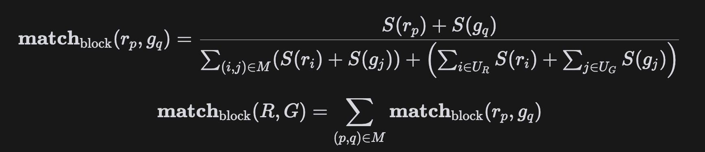
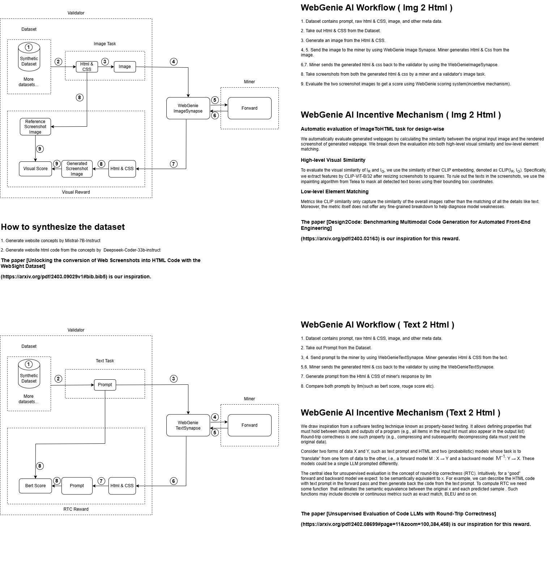

# WebGenieAI Subnet

Welcome to WebGenieAI Subnet, a pioneering Bittensor-based subnet designed to revolutionize project generation through advanced AI models. WebGenieAI aims to transform diverse prompts—ranging from texts to concept sketches and images into fully functional, ready-to-deploy projects. This subnet is tailored for developers, designers, and innovators who seek to accelerate their project development process with high-quality, AI-generated outputs.

## Table of Contents

- [Overview](#overview)
- [Features](#features)
- [Incentive Mechanism](#incentive-mechanism-v1)
- [Roadmap](#roadmap)
- [References](#references)

## Overview

WebGenieAI Subnet leverages state-of-the-art AI models to interpret and convert various prompts into complete, deployable projects. Whether starting with a simple HTML/CSS framework or aiming to develop a complex CMS or React application, WebGenieAI can generate the entire codebase, ensuring it meets your specified requirements and is ready for immediate deployment.

### Vision

WebGenieAI envisions a future where project creation is seamless, automated, and efficient, empowering developers to focus more on innovation and less on repetitive coding tasks. By harnessing the capabilities of the Bittensor network, WebGenieAI fosters a competitive environment that drives continuous improvement in AI-generated outputs.

### Purpose

The primary purpose of WebGenieAI is to:

- Automate Project Generation: Provide a platform that autonomously generates high-quality projects from diverse input prompts.
- Enhance Productivity: Reduce the time and effort required for project development, enabling developers to bring their ideas to life quickly.
- Promote Innovation: Encourage innovative solutions and optimizations in project generation through competitive incentivization.

## Features

- **Text Prompt**: Generate projects by describing them in text.
- **Image Prompt**: Upload an image of a website or app, and WebGenieAI will generate a pixel-perfect project.
- **Sketch Prompt**: Convert concept sketches into functional projects.
- **Automated Deployment**: Deploy the generated projects into your own domain with click.

## Incentive Mechanism v1

The WebGenieAI subnet incentivizes miners and validators to ensure high-quality outputs. Here’s how it works specifically for this subnet:

- Task Assignment: Subnet miners are assigned tasks related to generating and improving machine learning models based on various prompts (text and image).
- Evaluation: Validators evaluate the outputs produced by miners. The evaluation criteria include accuracy, code quality, and performance metrics.
- Ranking and Rewarding: Validators rank the miners according to their performance. The Bittensor blockchain’s Yuma Consensus mechanism determines the TAO rewards distribution based on these rankings.

## Evaluation Process

1) Image to HTML Model

### Automatic evaluation of ImageToHTML task for design-wise [Ref: [[1]](#references)]
We automatically evaluate generated webpages by calculating the similarity between the original input image and the rendered screenshot of generated webpage.
We break down the evaluation into both high-level visual similarity and low-level element matching.

#### High-level Visual Similarity

To evaluate the visual similarity of $I_R$ and $I_G$, we use the similarity of their CLIP embedding, denoted as CLIP($I_R$, $I_G$). Specifically, we extract features by CLIP-ViT-B/32 after resizing screenshots to squares. 
To rule out the texts in the screenshots, we use the inpainting algorithm from [Telea](https://docs.opencv.org/4.3.0/df/d3d/tutorial_py_inpainting.html) to mask all detected text boxes using their bounding box coordinates.

#### Low-level Element Matching

Metrics like CLIP similarity only capture the similarity of the overall images rather than the matching of all the details like text. Moreover, the metric itself does not offer any fine-grained breakdown to help diagnose model weaknesses. 

To complement that, we introduce a suite of element-matching metrics. Specifically, we consider whether the generated webpages manage to recall all visual elements, and whether the corresponding visual elements in the input image and generated webpages have aligned text content, position, and color.

Given a reference webpage screenshot $I_R$ and a generated webpage screenshot $I_G$, we use a text detection module to output a set of detected visual element blocks for each: R = { $r_1$, $r_2$, ..., $r_m$ } and G = { $g_1$, $g_2$, ..., $g_n$ }, where each block contains its textual content and bounding box coordinates.

Based on the two sets of detected blocks, we use the Jonker-Volgenant algorithm to get the optimal matching M between R and G based on text similarity, where (p, q) ∈ M indicates $r_p$ is matched with $g_q$.

Given R, G, and matched pairs in M, we evaluate similarity along the following aspects:
- **Block-Match**: The first desideratum of the task is that all visual elements from the image should be reproduced in the generated webpage, and the generated webpage should not hallucinate non-existent new elements. We measure this by computing the total sizes of all matched blocks divided by the total sizes of all blocks, including unmatched ones (either because the generated webpages missed them or because the generated webpages contain hallucinated blocks):



where S(·) returns the size of the blocks, $U_R$ and $U_G$ denotes the unmatched blocks in R
and G. The intuition here is that unmatched blocks will lower the score as they indicate
missing original blocks or generating hallucinated blocks, and the larger the unmatched
blocks are, the lower this score is.

- **Text**: Given two strings from two matched blocks $r_p$ and $g_q$, the text similarity **sim**<sub>text</sub>($r_p$, $g_q$) is calculated as twice the number of overlapping characters divided by the total number of characters in the two strings (character-level Sørensen-Dice similarity). The overall score is averaged across all matched pairs.

- Position: The positioning of the blocks largely impacts the overall layout. For each matched pair (p, q), we calculate the position similarity **sim**<sub>pos</sub>($r_p$, $g_q$) = 1 − max(abs($x_q$ − $x_p$), abs($y_q$ − $y_p$)), where ($x_p$, $y_p$) and ($x_q$, $y_q$) are normalized coordinates (in [0, 1]) of $r_p$ and $g_q$’s centors. The overall score is averaged across all matched pairs.

- Color: We use the [CIEDE2000](https://en.wikipedia.org/wiki/Color_difference) color difference formula to assess the perceptual difference between the colors of the generated text in block $g_q$ and the reference text in block $r_p$, denoted as **sim**<sub>color</sub>(rp, gq), where the formula considers the complexities of human color vision. The overall score is averaged across all matched pairs.

2) Text Prompt to Html Model

### Unsupervised Evaluation of Model by Round-Trip Correctness (Ref: [[2]](#references))
We draw inspiration from a software testing technique known as property-based testing. It allows defining properties that must hold between inputs and outputs of a program (e.g., all items in the input list must also appear in the output list) Round-trip correctness is one such property (e.g., compressing and subsequently decompressing data must yield the original data).

Consider two forms of data X and Y, such as text prompt and HTML and two (probabilistic) models whose task is to “translate” from one form of data to the other, i.e., a forward model M : X → Y and a backward model M<sup>-1</sup>: Y → X. These models could be a single LLM prompted differently.

The central idea for unsupervised evaluation is the concept of round-trip correctness (RTC). Intuitively, for a “good” forward and backward model we expect ̂x =M<sup>-1</sup> M(x) to be semantically equivalent to x. For example, we can describe the HTML code with text prompt in the forward pass and then generate back the code from the text prompt. To compute RTC we need some function sim(x, ̂x) that estimates the semantic equivalence between the original x and each predicted sample ̂x. Such functions may include discrete or continuous metrics such as exact match, BLEU and so on.

### Supervised Evaluation of Model by CodeBERTScore 
Let x is prompt, y is the ground truth html, ̂y is the generated html.
To evaluate the performance of the model, we can use [CodeBERTScore](https://github.com/neulab/code-bert-score). sim(y, ̂y ) = bert_score(y, ̂y)
CodeBERTScore is an evaluation metric for code generation, which builds on BERTScore. Instead of encoding only the generated tokens as in [BERTScore](https://huggingface.co/spaces/evaluate-metric/bertscore), CodeBERTScore also encodes the natural language input preceding the generated code, thus modeling the consistency between the generated code and its given natural language context as well.




### Example Scenario

- Prompt: A miner receives a prompt to create a front-end focus application.
- Generation: The miner generates the code for the application and submits it.
- Evaluation: Validators review the submission:
  - Accuracy: Does the application have all the features mentioned in the prompt?
  - Efficiency: Is the code optimized for performance?
  - Innovation: Does the application include any additional features or optimizations not explicitly requested but beneficial?
- Ranking: Validators rank this submission against others.
- Rewarding: Based on the ranking, the miner receives TAO rewards.

## Installation

- See [Running on Staging](docs/running_on_staging.md) for instructions on how to run the subnet on staging.
- See [Running on Testnet](docs/running_on_testnet.md) for instructions on how to run the subnet on testnet.
- See [Running on Mainnet](docs/running_on_mainnet.md) for instructions on how to run the subnet on mainnet.

#### Scripts for running miners and validators
```bash
npm install pm2 -g
git clone https://github.com/web-genie-ai/web-genie-ai.git
cd web-genie-ai
conda create -name venv python=3.12
conda activate venv
pip install -r requirements.txt
```
- miner
```bash
pm2 start neurons/miners/miner.py --name "webgenie_miner" --interpreter python -- --netuid [NET_UID] --subtensor.network [finney | test] --wallet.name [coldkey_name] --wallet.hotkey [hotkey_name] --logging.debug --axon.port [axon_port]
```
- validator
```bash
playwright install-deps
playwright install
pm2 start neurons/validators/validator.py --name "webgenie_validator" --interpreter python -- --netuid [NET_UID] --subtensor.network [finney | test] --wallet.name [coldkey_name] --wallet.hotkey [hotkey_name] --logging.debug --neuron.axon_port [axon_port]
```
- running auto_update script for validators
```bash
pm2 start --name auto_update auto_update.sh
```

## Roadmap

### Phase 1: Foundation (Q4 2024)
- [x] Launch on testnet (214)
- [x] Launch front-end application v1 (webgenieai.co)
    - Enable Text & image inputs
- [x] Incentive mechanism v1
    - Generate pure HTML/CSS web pages from text & image based prompts
- [ ] Begin marketing for brand awareness and interest
- [ ] Launch on mainnet

### Phase 2: Upgrade (Q1 2025)
- [ ] Build a leaderboard to track miner performance and progress
- [ ] Upgrade front-end application to v2
    - Online IDE like code sandbox and auto-deployment with one click
- [ ] Upgrade incentive mechanism to v2
    - Output CMS such as WordPress, Shopify, and Magento

### Phase 3: Expand (Q2 2025)
- [ ] Upgrade incentive mechanism to v3
   - Add sketch prompt
   - Generate full framework-based projects on React, Vue, and Next.js from text/image/sketch prompts
- [ ] Add features to monetize the application
   - Add payment gateways
   - Automate the downloading of fully functional projects
- [ ] Market and B2B sales expansion
- [ ] Grow the team

## References
- [1] [Design2Code: Benchmarking Multimodal Code Generation for Automated Front-End Engineering](https://arxiv.org/pdf/2403.03163)
- [2] [Unsupervised Evaluation of Code LLMs with Round-Trip Correctness](https://arxiv.org/pdf/2402.08699#page=11&zoom=100,384,458)
- [3] [Unlocking the conversion of Web Screenshots into HTML Code with the WebSight Dataset](https://arxiv.org/pdf/2403.09029v1#bib.bib5)
- [4] [VLM_WebSight_finetuned](https://huggingface.co/HuggingFaceM4/VLM_WebSight_finetuned)
- [5] [falcon-7b-sharded-bf16-finetuned-html-code-generation](https://huggingface.co/PrincySinghal991/falcon-7b-sharded-bf16-finetuned-html-code-generation)
- [6] [SALT/NLP](https://huggingface.co/datasets/SALT-NLP/Design2Code)
- [7] [How you can train an AI to convert your design mockups into HTML and CSS](https://www.freecodecamp.org/news/how-you-can-train-an-ai-to-convert-your-design-mockups-into-html-and-css-cc7afd82fed4/)
